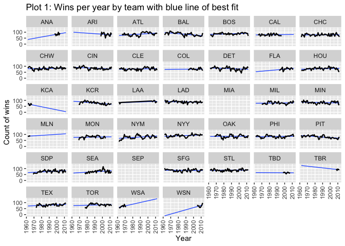

Module 2 - Chi-Square Testing and ANOVA
================
Justin Ehringhaus
October 04, 2022

-   <a href="#textbook-problems" id="toc-textbook-problems">Textbook
    Problems</a>
    -   <a href="#section-11-1" id="toc-section-11-1">Section 11-1</a>
        -   <a href="#6-blood-types" id="toc-6-blood-types">6. Blood Types</a>
        -   <a href="#8-on-time-performance-by-airline"
            id="toc-8-on-time-performance-by-airline">8. On-Time Performance by
            Airline</a>
    -   <a href="#section-11-2" id="toc-section-11-2">Section 11-2</a>
        -   <a href="#8-ethnicity-and-movie-admissions"
            id="toc-8-ethnicity-and-movie-admissions">8. Ethnicity and Movie
            Admissions</a>
        -   <a href="#10-women-in-the-military"
            id="toc-10-women-in-the-military">10. Women in the Military</a>
    -   <a href="#section-12-1" id="toc-section-12-1">Section 12-1</a>
        -   <a href="#8-sodium-contents-of-foods"
            id="toc-8-sodium-contents-of-foods">8. Sodium Contents of Foods</a>
    -   <a href="#section-12-2" id="toc-section-12-2">Section 12-2</a>
        -   <a href="#10-sales-for-leading-companies"
            id="toc-10-sales-for-leading-companies">10. Sales for Leading
            Companies</a>
        -   <a href="#12-per-pupil-expenditures"
            id="toc-12-per-pupil-expenditures">12. Per-Pupil Expenditures</a>
    -   <a href="#section-12-3" id="toc-section-12-3">Section 12-3</a>
        -   <a href="#10-increasing-plant-growth"
            id="toc-10-increasing-plant-growth">10. Increasing Plant Growth</a>
-   <a href="#baseball-dataset---on-your-own"
    id="toc-baseball-dataset---on-your-own">Baseball Dataset - “On Your
    Own”</a>
    -   <a href="#chi-square-goodness-of-fit-test"
        id="toc-chi-square-goodness-of-fit-test">Chi-Square Goodness-of-Fit
        Test</a>
        -   <a href="#baseball-wins-by-decade"
            id="toc-baseball-wins-by-decade">Baseball wins by decade</a>
-   <a href="#references" id="toc-references">References</a>

------------------------------------------------------------------------



``` r
# █▀█ ▄▀█ █▀▀ █▄▀ ▄▀█ █▀▀ █▀▀ █▀
# █▀▀ █▀█ █▄▄ █░█ █▀█ █▄█ ██▄ ▄█
library(pacman)
p_load(tidyverse)
p_load(ggthemes)
p_load(glue)
p_load(onewaytests)
p_load(skimr)
p_load(knitr)
```

------------------------------------------------------------------------

## Textbook Problems

``` r
# helper function for generating tibble with important values 
report_values <- function(test, alpha) {
  test.method <- ifelse(
    str_detect(test$method, "Chi-squared"), "chi.squared", "anova")
  switch(test.method,
         "chi.squared" = tibble(
           alpha = alpha,
           degrees = unname(test$parameter),
           cv = round(qchisq(p = alpha, df = degrees, 
                             lower.tail = FALSE), 3),
           test.value = round(unname(test$statistic), 3)),
         "anova" = tibble(
           alpha = alpha,
           df.N = test$parameter[1],
           df.D = test$parameter[2],
           cv = round(qf(p = alpha, 
                         df1 = df.N, df2 = df.D, 
                         lower.tail = FALSE), 2),
           test.value = round(test$statistic, 2)))}

# helper function for making the decision
decision <- function(values) {
  significant <- values$test.value > values$cv
  ifelse(significant == TRUE, 
         glue("Reject the null hypothesis. 
              The test value of {values$test.value} 
              is greater than the critical value of {values$cv}"), 
         glue("Do not reject the null hypothesis. 
              The test value of {values$test.value}
              is less than the critical value of {values$cv}"))}

# helper function for summarizing the result
results <- function(values, hypotheses) {
  significant <- values$test.value > values$cv
  claim <- gsub(" (claim)", "", hypotheses$h1, fixed = TRUE)
  ifelse(significant == TRUE, 
         glue("There is sufficient evidence to support 
              the claim that {claim}."), 
         glue("There is not enough evidence to support 
              the claim that {claim}."))}
```

### Section 11-1

#### 6. Blood Types

> A medical researcher wishes to see if hospital patients in a large
> hospital have the same blood type distribution as those in the general
> population. The distribution for the general population is as follows:
> type A, 20%; type B, 28%; type O, 36%; and type AB = 16%. He selects a
> random sample of 50 patients and finds the following: 12 have type A
> blood, 8 have type B, 24 have type O, and 6 have type AB blood.
>
> At α = 0.10, can it be concluded that the distribution is the same as
> that of the general population?

###### Log the known information

``` r
data <- tibble(
  E = c(0.20, 0.28, 0.36, 0.16),
  O = c(12, 8, 24, 6))
chi.sq <- chisq.test(x = data$O, p = data$E)
values <- report_values(test = chi.sq, alpha = 0.10)
```

###### State the hypotheses and identify the claim.

``` r
hypotheses <- 
  tibble(
    h0 = "the distribution for the general population is: type A, 20%; type B, 28%; type O, 36%; and type AB = 16%",
    h1 = "the distribution differs from that of the general population (claim)")
```

| h0                                                                                                       | h1                                                                   |
|:---------------------------------------------------------------------------------------------------------|:---------------------------------------------------------------------|
| the distribution for the general population is: type A, 20%; type B, 28%; type O, 36%; and type AB = 16% | the distribution differs from that of the general population (claim) |

###### Find the critical value and test value.

| alpha | degrees |    cv | test.value |
|------:|--------:|------:|-----------:|
|   0.1 |       3 | 6.251 |      5.471 |

###### Make the decision.

Do not reject the null hypothesis. The test value of 5.471 is less than
the critical value of 6.251

###### Summarize the results.

There is not enough evidence to support the claim that the distribution
differs from that of the general population.

#### 8. On-Time Performance by Airline

> According to the Bureau of Transportation Statistics, on-time
> performance by the airlines is described as follows:

| Action                                          | % of Time |
|-------------------------------------------------|-----------|
| On time                                         | 70.8      |
| National Aviation System delay                  | 8.2       |
| Aircraft arriving late                          | 9.0       |
| Other (because of weather and other conditions) | 12.0      |

> Records of 200 randomly selected flights for a major airline company
> showed that 125 planes were on time; 40 were delayed because of
> weather, 10 because of a National Aviation System delay, and the rest
> because of arriving late. At α = 0.05, do these results differ from
> the government’s statistics?

###### Log the known information

``` r
data <- tibble(
  E = c(.708, .082, .09, .12),
  O = c(125, 10, 25, 40))

chi.sq <- chisq.test(x = data$O, p = data$E)
values <- report_values(test = chi.sq, alpha = 0.03)
```

###### State the hypotheses and identify the claim.

``` r
hypotheses <- 
  tibble(
    h0 = "the performance of airlines is that 70.8% were on time, 12% were delayed for various reasons, 8.2% were delayed by the National Aviation System, and 9% were delayed by other aircraft arriving late",
    h1 = "the proportions of delays are different from those stated in the null hypothesis (claim)")
```

| h0                                                                                                                                                                                                   | h1                                                                                       |
|:-----------------------------------------------------------------------------------------------------------------------------------------------------------------------------------------------------|:-----------------------------------------------------------------------------------------|
| the performance of airlines is that 70.8% were on time, 12% were delayed for various reasons, 8.2% were delayed by the National Aviation System, and 9% were delayed by other aircraft arriving late | the proportions of delays are different from those stated in the null hypothesis (claim) |

###### Find the critical value and test value.

| alpha | degrees |    cv | test.value |
|------:|--------:|------:|-----------:|
|  0.03 |       3 | 8.947 |     17.832 |

###### Make the decision.

Reject the null hypothesis. The test value of 17.832 is greater than the
critical value of 8.947

###### Summarize the results.

There is sufficient evidence to support the claim that the proportions
of delays are different from those stated in the null hypothesis.

### Section 11-2

#### 8. Ethnicity and Movie Admissions

> Are movie admissions related to ethnicity? A 2014 study indicated the
> following numbers of admissions (in thousands) for two different
> years. At the 0.05 level of significance, can it be concluded that
> movie attendance by year was dependent upon ethnicity?

|      | Caucasian | Hispanic | African American | Other |
|------|-----------|----------|------------------|-------|
| 2013 | 724       | 335      | 174              | 107   |
| 2014 | 370       | 292      | 152              | 140   |

###### Log the known information

``` r
data <- data.frame(
  Caucasion = c(724, 370),
  Hispanic = c(335, 292),
  African_American = c(174, 152),
  Other = c(107, 140))
rownames(data) <- c(2013, 2014)

chi.sq <- chisq.test(data)
values <- report_values(test = chi.sq, alpha = 0.05)
```

###### State the hypotheses and identify the claim.

``` r
hypotheses <- 
  tibble(
    h0 = "movie attendance by year is independent of the ethnicity of the movie goers",
    h1 = "movie attendance by year is dependent upon the ethnicity of the movie goers (claim)")
```

| h0                                                                          | h1                                                                                  |
|:----------------------------------------------------------------------------|:------------------------------------------------------------------------------------|
| movie attendance by year is independent of the ethnicity of the movie goers | movie attendance by year is dependent upon the ethnicity of the movie goers (claim) |

###### Find the critical value and test value.

| alpha | degrees |    cv | test.value |
|------:|--------:|------:|-----------:|
|  0.05 |       3 | 7.815 |     60.144 |

###### Make the decision.

Reject the null hypothesis. The test value of 60.144 is greater than the
critical value of 7.815

###### Summarize the results.

There is sufficient evidence to support the claim that movie attendance
by year is dependent upon the ethnicity of the movie goers.

#### 10. Women in the Military

> This table lists the numbers of officers and enlisted personnel for
> women in the military. At α = 0.05, is there sufficient evidence to
> conclude that a relationship exists between rank and branch of the
> Armed Forces?

| Action       | Officers | Enlisted |
|--------------|----------|----------|
| Army         | 10,791   | 62,491   |
| Navy         | 7,816    | 42,750   |
| Marine Corps | 932      | 9,525    |
| Air Force    | 11,819   | 54,344   |

###### Log the known information

``` r
data <- data.frame(
  Officers = c(10791, 7816, 932, 11819),
  Enlisted = c(62491, 42750, 9525, 54344)
  )
rownames(data) <- c("Army", "Navy", "Marine Corps", "Air Force")

chi.sq <- chisq.test(data)
values <- report_values(test = chi.sq, alpha = 0.05)
```

###### State the hypotheses and identify the claim.

``` r
hypotheses <- 
  tibble(
    h0 = "the rank of women personnel is independent of the military branch of service",
    h1 = "the rank of women personnel is dependent upon the military branch of service (claim)")
```

| h0                                                                           | h1                                                                                   |
|:-----------------------------------------------------------------------------|:-------------------------------------------------------------------------------------|
| the rank of women personnel is independent of the military branch of service | the rank of women personnel is dependent upon the military branch of service (claim) |

###### Find the critical value and test value.

| alpha | degrees |    cv | test.value |
|------:|--------:|------:|-----------:|
|  0.05 |       3 | 7.815 |    654.272 |

###### Make the decision.

Reject the null hypothesis. The test value of 654.272 is greater than
the critical value of 7.815

###### Summarize the results.

There is sufficient evidence to support the claim that the rank of women
personnel is dependent upon the military branch of service.

### Section 12-1

#### 8. Sodium Contents of Foods

> The amount of sodium (in milligrams) in one serving for a random
> sample of three different kinds of foods is listed. At the 0.05 level
> of significance, is there sufficient evidence to conclude that a
> difference in mean sodium amounts exists among condiments, cereals,
> and desserts?

| Condiments | Cereals | Desserts |
|------------|---------|----------|
| 270        | 260     | 100      |
| 130        | 220     | 180      |
| 230        | 290     | 250      |
| 180        | 290     | 250      |
| 80         | 200     | 300      |
| 70         | 320     | 360      |
| 200        | 140     | 300      |
|            |         | 160      |

###### Log the known information

``` r
data <- bind_rows(
  tibble(Type = "Condiments", Sodium = c(270, 130, 230, 180, 80, 70, 200, NA)),
  tibble(Type = "Cereals", Sodium = c(260, 220, 290, 290, 200, 320, 140, NA)),
  tibble(Type = "Desserts", Sodium = c(100, 180, 250, 250, 300, 360, 300, 160)))

one.anova <- aov.test(Sodium ~ Type, data = data, alpha = 0.05)
```

    ## 
    ##   One-Way Analysis of Variance (alpha = 0.05) 
    ## ------------------------------------------------------------- 
    ##   data : Sodium and Type 
    ## 
    ##   statistic  : 2.398538 
    ##   num df     : 2 
    ##   denom df   : 19 
    ##   p.value    : 0.1178108 
    ## 
    ##   Result     : Difference is not statistically significant. 
    ## -------------------------------------------------------------

``` r
values <- report_values(test = one.anova, alpha = one.anova$alpha)
```

###### State the hypotheses and identify the claim.

``` r
hypotheses <- 
  tibble(
    h0 = "the mean amount of sodium in condiments, cereals, and desserts is the same",
    h1 = "at least one mean is different from the others (claim)")
```

| h0                                                                         | h1                                                     |
|:---------------------------------------------------------------------------|:-------------------------------------------------------|
| the mean amount of sodium in condiments, cereals, and desserts is the same | at least one mean is different from the others (claim) |

###### Find the critical value and test value.

| alpha | df.N | df.D |   cv | test.value |
|------:|-----:|-----:|-----:|-----------:|
|  0.05 |    2 |   19 | 3.52 |        2.4 |

###### Make the decision.

Do not reject the null hypothesis. The test value of 2.4 is less than
the critical value of 3.52

###### Summarize the results.

There is not enough evidence to support the claim that at least one mean
is different from the others.

### Section 12-2

#### 10. Sales for Leading Companies

> The sales in millions of dollars for a year of a sample of leading
> companies are shown. At α = 0.01, is there a significant difference in
> the means?

| Cereal | Chocolate Candy | Coffee |
|--------|-----------------|--------|
| 578    | 311             | 261    |
| 320    | 106             | 185    |
| 264    | 109             | 302    |
| 249    | 125             | 689    |
| 237    | 173             |        |

###### Log the known information

``` r
data <- bind_rows(
  tibble(Type = "Cereal", Sales.in.millions = c(578, 320, 264, 249, 237)),
  tibble(Type = "Chocolate Candy", Sales.in.millions = c(311, 106, 109, 125, 173)),
  tibble(Type = "Coffee", Sales.in.millions = c(261, 185, 302, 689, NA)))

one.anova <- aov.test(Sales.in.millions ~ Type, data = data, alpha = 0.01)
```

    ## 
    ##   One-Way Analysis of Variance (alpha = 0.01) 
    ## ------------------------------------------------------------- 
    ##   data : Sales.in.millions and Type 
    ## 
    ##   statistic  : 2.171782 
    ##   num df     : 2 
    ##   denom df   : 11 
    ##   p.value    : 0.1603487 
    ## 
    ##   Result     : Difference is not statistically significant. 
    ## -------------------------------------------------------------

``` r
values <- report_values(test = one.anova, alpha = one.anova$alpha)
```

###### State the hypotheses and identify the claim.

``` r
hypotheses <- 
  tibble(
    h0 = "the mean amount of sales for cereal, chocolate candy, and coffee is the same",
    h1 = "at least one mean is different from the others (claim)")
```

| h0                                                                           | h1                                                     |
|:-----------------------------------------------------------------------------|:-------------------------------------------------------|
| the mean amount of sales for cereal, chocolate candy, and coffee is the same | at least one mean is different from the others (claim) |

###### Find the critical value and test value.

| alpha | df.N | df.D |   cv | test.value |
|------:|-----:|-----:|-----:|-----------:|
|  0.01 |    2 |   11 | 7.21 |       2.17 |

###### Make the decision.

Do not reject the null hypothesis. The test value of 2.17 is less than
the critical value of 7.21

###### Summarize the results.

There is not enough evidence to support the claim that at least one mean
is different from the others.

#### 12. Per-Pupil Expenditures

> The expenditures (in dollars) per pupil for states in three sections
> of the country are listed. Using α = 0.05, can you conclude that there
> is a difference in means?

| Eastern third | Middle third | Western third |
|---------------|--------------|---------------|
| 4946          | 6149         | 5282          |
| 5953          | 7451         | 8605          |
| 6202          | 6000         | 6528          |
| 7243          | 6479         | 6911          |
| 6113          |              |               |

###### Log the known information

``` r
data <- bind_rows(
  tibble(Type = "Eastern third", Expenditures = c(4946, 5953, 6202, 7243, 6113)),
  tibble(Type = "Middle third", Expenditures = c(6149, 7451, 6000, 6479, NA)),
  tibble(Type = "Western third", Expenditures = c(5282, 8605, 6528, 6911, NA)))

one.anova <- aov.test(Expenditures ~ Type, data = data, alpha = 0.05)
```

    ## 
    ##   One-Way Analysis of Variance (alpha = 0.05) 
    ## ------------------------------------------------------------- 
    ##   data : Expenditures and Type 
    ## 
    ##   statistic  : 0.6488214 
    ##   num df     : 2 
    ##   denom df   : 10 
    ##   p.value    : 0.5433264 
    ## 
    ##   Result     : Difference is not statistically significant. 
    ## -------------------------------------------------------------

``` r
values <- report_values(test = one.anova, alpha = one.anova$alpha)
```

###### State the hypotheses and identify the claim.

``` r
hypotheses <- 
  tibble(
    h0 = "the mean expenditures (in dollars) per student for states in three sections of the country are the same",
    h1 = "at least one mean is different from the others (claim)")
```

| h0                                                                                                      | h1                                                     |
|:--------------------------------------------------------------------------------------------------------|:-------------------------------------------------------|
| the mean expenditures (in dollars) per student for states in three sections of the country are the same | at least one mean is different from the others (claim) |

###### Find the critical value and test value.

| alpha | df.N | df.D |  cv | test.value |
|------:|-----:|-----:|----:|-----------:|
|  0.05 |    2 |   10 | 4.1 |       0.65 |

###### Make the decision.

Do not reject the null hypothesis. The test value of 0.65 is less than
the critical value of 4.1

###### Summarize the results.

There is not enough evidence to support the claim that at least one mean
is different from the others.

### Section 12-3

#### 10. Increasing Plant Growth

> A gardening company is testing new ways to improve plant growth.
> Twelve plants are randomly selected and exposed to a combination of
> two factors, a “Grow-light” in two different strengths and a plant
> food supplement with different mineral supplements. After a number of
> days, the plants are measured for growth, and the results (in inches)
> are put into the appropriate boxes.

|              | Grow-light 1  | Grow-light 2  |
|--------------|---------------|---------------|
| Plant food A | 9.2, 9.4, 8.9 | 8.5, 9.2, 8.9 |
| Plant food B | 7.1, 7.2, 8.5 | 5.5, 5.8, 7.6 |

> Can an interaction between the two factors be concluded? Is there a
> difference in mean growth with respect to light? With respect to plant
> food? Use α = 0.05.

###### Log the known information

``` r
data <- bind_rows(
  tibble(Plant.food = "A", Grow.light = c(9.2, 9.4, 8.9), Type = c("GL1")),
  tibble(Plant.food = "A", Grow.light = c(8.5, 9.2, 8.9), Type = c("GL2")),
  tibble(Plant.food = "B", Grow.light = c(7.1, 7.2, 8.5), Type = c("GL1")),
  tibble(Plant.food = "B", Grow.light = c(5.5, 5.8, 7.6), Type = c("GL2")))
data$Plant.food <- factor(data$Plant.food)
data$Type <- factor(data$Type)

two.anova <- aov(Grow.light ~ Plant.food * Type, data = data)

values <- tibble(
  alpha = 0.05,
  df.N = summary(two.anova)[[1]][[1]][1],
  df.D = summary(two.anova)[[1]][[1]][4],
  Plant.food.ss = summary(two.anova)[[1]][[2]][1],
  Plant.food.F = summary(two.anova)[[1]][[4]][1],
  Grow.light.ss = summary(two.anova)[[1]][[2]][2],
  Grow.light.F = summary(two.anova)[[1]][[4]][2],
  Interaction.ss = summary(two.anova)[[1]][[2]][3],
  Interaction.F = summary(two.anova)[[1]][[4]][3],
  cv = round(qf(p = alpha, df1 = df.N, df2 = df.D, lower.tail = FALSE), 2))
```

###### State the hypotheses and identify the claim.

``` r
hypotheses <- 
  tibble(
    h0.interaction = "There is no interaction between the strength of the grow light and the plant food supplement",
    h1.interaction = "There is an interaction between the strength of the grow light and the plant food supplement (claim)",
    h0.plant.food = "There is no difference between mean growth with respect to the type of plant food supplement",
    h1.plant.food = "There is a difference between mean growth with respect to the type of plant food supplement (claim)",
    h0.grow.light = "There is no difference between mean growth with respect to the strength of the grow light",
    h1.grow.light = "There is a difference between mean growth with respect to the strength of the grow light (claim)",
    )
```

| h0.interaction                                                                               | h1.interaction                                                                                       | h0.plant.food                                                                                | h1.plant.food                                                                                       | h0.grow.light                                                                             | h1.grow.light                                                                                    |
|:---------------------------------------------------------------------------------------------|:-----------------------------------------------------------------------------------------------------|:---------------------------------------------------------------------------------------------|:----------------------------------------------------------------------------------------------------|:------------------------------------------------------------------------------------------|:-------------------------------------------------------------------------------------------------|
| There is no interaction between the strength of the grow light and the plant food supplement | There is an interaction between the strength of the grow light and the plant food supplement (claim) | There is no difference between mean growth with respect to the type of plant food supplement | There is a difference between mean growth with respect to the type of plant food supplement (claim) | There is no difference between mean growth with respect to the strength of the grow light | There is a difference between mean growth with respect to the strength of the grow light (claim) |

###### Find the critical value and test value.

| alpha | df.N | df.D | Plant.food.ss | Plant.food.F | Grow.light.ss | Grow.light.F | Interaction.ss | Interaction.F |   cv |
|------:|-----:|-----:|--------------:|-------------:|--------------:|-------------:|---------------:|--------------:|-----:|
|  0.05 |    1 |    8 |      12.81333 |      24.5623 |          1.92 |     3.680511 |           0.75 |        1.4377 | 5.32 |

###### Make the decision and summarize the results

Since the F test value for plant food (24.56) is greater than the
critical value (5.32), reject the null hypothesis for plant food. There
is sufficient evidence to support the claim that there is a difference
between mean growth with respect to the type of plant food supplement.

Since the F test value for grow light (3.68) is lower than the critical
value (5.32) and since the F test value for an interaction between plant
food and grow light (1.44) is lower than the critical value (5.32), do
not reject the null hypotheses. There is not sufficient evidence to
support that there is a difference between mean growth with respect to
the strength of the grow light or that there is an interaction between
the strength of the grow light and the plant food supplement.

------------------------------------------------------------------------

## Baseball Dataset - “On Your Own”

``` r
baseball <- read_csv("/Users/justin/Desktop/ALY 6015/Assignments/M2/chi-square-testing-and-anova/baseball.csv")
```

    ## Rows: 1232 Columns: 15
    ## ── Column specification ────────────────────────────────────────────────────────
    ## Delimiter: ","
    ## chr  (2): Team, League
    ## dbl (13): Year, RS, RA, W, OBP, SLG, BA, Playoffs, RankSeason, RankPlayoffs,...
    ## 
    ## ℹ Use `spec()` to retrieve the full column specification for this data.
    ## ℹ Specify the column types or set `show_col_types = FALSE` to quiet this message.

``` r
skim(baseball)
```

|                                                  |          |
|:-------------------------------------------------|:---------|
| Name                                             | baseball |
| Number of rows                                   | 1232     |
| Number of columns                                | 15       |
| \_\_\_\_\_\_\_\_\_\_\_\_\_\_\_\_\_\_\_\_\_\_\_   |          |
| Column type frequency:                           |          |
| character                                        | 2        |
| numeric                                          | 13       |
| \_\_\_\_\_\_\_\_\_\_\_\_\_\_\_\_\_\_\_\_\_\_\_\_ |          |
| Group variables                                  | None     |

Data summary

**Variable type: character**

| skim_variable | n_missing | complete_rate | min | max | empty | n_unique | whitespace |
|:--------------|----------:|--------------:|----:|----:|------:|---------:|-----------:|
| Team          |         0 |             1 |   3 |   3 |     0 |       39 |          0 |
| League        |         0 |             1 |   2 |   2 |     0 |        2 |          0 |

**Variable type: numeric**

| skim_variable | n_missing | complete_rate |    mean |    sd |      p0 |     p25 |     p50 |     p75 |    p100 | hist  |
|:--------------|----------:|--------------:|--------:|------:|--------:|--------:|--------:|--------:|--------:|:------|
| Year          |         0 |          1.00 | 1988.96 | 14.82 | 1962.00 | 1976.75 | 1989.00 | 2002.00 | 2012.00 | ▆▆▇▆▇ |
| RS            |         0 |          1.00 |  715.08 | 91.53 |  463.00 |  652.00 |  711.00 |  775.00 | 1009.00 | ▁▆▇▃▁ |
| RA            |         0 |          1.00 |  715.08 | 93.08 |  472.00 |  649.75 |  709.00 |  774.25 | 1103.00 | ▂▇▆▂▁ |
| W             |         0 |          1.00 |   80.90 | 11.46 |   40.00 |   73.00 |   81.00 |   89.00 |  116.00 | ▁▃▇▆▁ |
| OBP           |         0 |          1.00 |    0.33 |  0.02 |    0.28 |    0.32 |    0.33 |    0.34 |    0.37 | ▁▃▇▅▁ |
| SLG           |         0 |          1.00 |    0.40 |  0.03 |    0.30 |    0.38 |    0.40 |    0.42 |    0.49 | ▁▅▇▅▁ |
| BA            |         0 |          1.00 |    0.26 |  0.01 |    0.21 |    0.25 |    0.26 |    0.27 |    0.29 | ▁▂▇▆▂ |
| Playoffs      |         0 |          1.00 |    0.20 |  0.40 |    0.00 |    0.00 |    0.00 |    0.00 |    1.00 | ▇▁▁▁▂ |
| RankSeason    |       988 |          0.20 |    3.12 |  1.74 |    1.00 |    2.00 |    3.00 |    4.00 |    8.00 | ▇▃▅▂▁ |
| RankPlayoffs  |       988 |          0.20 |    2.72 |  1.10 |    1.00 |    2.00 |    3.00 |    4.00 |    5.00 | ▅▅▇▇▁ |
| G             |         0 |          1.00 |  161.92 |  0.62 |  158.00 |  162.00 |  162.00 |  162.00 |  165.00 | ▁▁▇▁▁ |
| OOBP          |       812 |          0.34 |    0.33 |  0.02 |    0.29 |    0.32 |    0.33 |    0.34 |    0.38 | ▂▇▇▃▁ |
| OSLG          |       812 |          0.34 |    0.42 |  0.03 |    0.35 |    0.40 |    0.42 |    0.44 |    0.50 | ▁▆▇▅▁ |

``` r
baseball %>% 
  ggplot +
  aes(Year, W) +
  geom_smooth(method = "lm", se = FALSE, size = 0.5, fullrange = TRUE) +
  geom_line(size = 0.8) +
  facet_wrap(~ Team) +
  labs(title = "Plot 1: Wins per year by team with blue line of best fit",
       y = "Count of wins") +
  theme(axis.text.x = element_text(angle = 90, vjust = 0.5, hjust=1))
```

    ## `geom_smooth()` using formula 'y ~ x'
    ## geom_path: Each group consists of only one observation. Do you need to adjust
    ## the group aesthetic?
    ## geom_path: Each group consists of only one observation. Do you need to adjust
    ## the group aesthetic?

<!-- -->

Billy Beane and Paul DePodesta changed baseball history by using
statistics to recruit undervalued players. They examined the
relationships between stats such as on-base percentage (OBP) and
slugging percentage (SLG) in relation to runs scored (RS) and playoffs
(binary), coming up with statistical methods to predict great players
who could be recruited on a low budget. This data set is an exercise in
finding “truth” in data, and the goal of this assignment is to apply a
Chi-Squared Goodness of Fit test to see if there is a difference in the
number of wins per team by decade.

To give an overview of the dataset, there are 15 variables and 1232
rows. There are 13 numeric variables (discrete or continuous), and 2
character variables (Team and League - nominal). The completion rate for
all variables except RankSeason, RankPlayoffs, OOBP, and OSLG is 100%.
These four variables with missing data have between a 20 to 30%
completion rate. Data was collected from years 1962 to 2012, and as this
assignments concerns the number of wins, it should be noted that the
mean number of wins (W) is 80.9 with a standard deviation of 11.46, a
maximum value of 116, and a minimum value of 40. The number of games
played per team by year (G) remains relatively constant throughout all
years with a mean value of 161.92 and a standard deviation of 0.62,
implying that this data set is well-balanced and the games played (G)
should not bias wins (W).

In Plot 1, wins per team by year is displayed with lines of best fit.
Some teams have little data (e.g., MIA/ANA), some teams have sporadic
data (e.g., LAA), and generally teams with data spanning all years have
near-flat slopes on the line of best fit. Newer teams such as WSN have a
steep positive slope, but their newness discredits this finding. NYM and
ATL visually appear to have the steepest positive slope among teams that
have played since the 1960s. PIT visually appears to have the steepest
negative slope among teams that have played since the 1960s.

### Chi-Square Goodness-of-Fit Test

``` r
# Extract decade from year
baseball$Decade <- baseball$Year - (baseball$Year %% 10)
```

#### Baseball wins by decade

> The baseball dataset contains teams’ number of wins by decade. At α =
> 0.05 can it be concluded that there is a difference in the number of
> wins by decade?

###### Log the known information

``` r
wins.per.decade <- baseball %>%
  select(Decade, W) %>%
  group_by(Decade) %>%
  summarize(O = sum(W)) %>%
  ungroup() %>%
  mutate(E = O / sum(O)) %>%
  t()

chi.sq <- chisq.test(x = wins.per.decade["O",], 
                     p = wins.per.decade["E",])
values <- report_values(test = chi.sq, alpha = 0.05)
```

###### State the hypotheses and identify the claim.

``` r
hypotheses <- 
  tibble(
    h0 = "there is no difference in the number of wins by decade",
    h1 = "there is a difference in the number of wins by decade (claim)")
```

| h0                                                     | h1                                                            |
|:-------------------------------------------------------|:--------------------------------------------------------------|
| there is no difference in the number of wins by decade | there is a difference in the number of wins by decade (claim) |

###### Find the critical value and test value.

| alpha | degrees |    cv | test.value |
|------:|--------:|------:|-----------:|
|  0.05 |       5 | 11.07 |          0 |

###### Make the decision.

Do not reject the null hypothesis. The test value of 0 is less than the
critical value of 11.07

###### Summarize the results.

There is not enough evidence to support the claim that there is a
difference in the number of wins by decade.

###### Does comparing the critical value with the test value provide the same result as

comparing the p-value from R with the significance level?

``` r
chi.sq
```

    ## 
    ##  Chi-squared test for given probabilities
    ## 
    ## data:  wins.per.decade["O", ]
    ## X-squared = 0.00000000000000000000000000024939, df = 5, p-value = 1

The decision not to reject the null hypothesis is the same when
comparing the p-value (1) from R with the significance level (alpha =
0.05).

------------------------------------------------------------------------

``` r
crops <- read_csv("/Users/justin/Desktop/ALY 6015/Assignments/M2/chi-square-testing-and-anova/crop_data.csv")
```

    ## Rows: 96 Columns: 4
    ## ── Column specification ────────────────────────────────────────────────────────
    ## Delimiter: ","
    ## dbl (4): density, block, fertilizer, yield
    ## 
    ## ℹ Use `spec()` to retrieve the full column specification for this data.
    ## ℹ Specify the column types or set `show_col_types = FALSE` to quiet this message.

``` r
# The block variable is superfluous -- it can  be dropped.
crops <- crops %>% select(-block)
```

``` r
crops$fertilizer <- factor(crops$fertilizer)
crops$density <- factor(crops$density)

two.anova <- aov(yield ~ fertilizer * density, data = crops)

values <- tibble(
  alpha = 0.05,
  df.N = summary(two.anova)[[1]][[1]][1],
  df.D = summary(two.anova)[[1]][[1]][4],
  fertilizer.ss = summary(two.anova)[[1]][[2]][1],
  fertilizer.F = summary(two.anova)[[1]][[4]][1],
  density.ss = summary(two.anova)[[1]][[2]][2],
  density.F = summary(two.anova)[[1]][[4]][2],
  Interaction.ss = summary(two.anova)[[1]][[2]][3],
  Interaction.F = summary(two.anova)[[1]][[4]][3],
  cv = round(qf(p = alpha, df1 = df.N, df2 = df.D, lower.tail = FALSE), 2))
```

###### State the hypotheses and identify the claim.

``` r
hypotheses <- 
  tibble(
    h0.interaction = "There is no interaction between the fertilizer used and plant density",
    h1.interaction = "There is an interaction between the fertilizer used and plant density (claim)",
    h0.fertilizer = "There is no difference between the fertilizer used with respect to the grain yield",
    h1.fertilizer = "There is a difference between the fertilizer used with respect to the grain yield (claim)",
    h0.density = "There is no difference between the plant density with respect to the grain yield",
    h1.density = "There is a difference between the plant density with respect to the grain yield (claim)",
    )
```

| h0.interaction                                                        | h1.interaction                                                                | h0.fertilizer                                                                      | h1.fertilizer                                                                             | h0.density                                                                       | h1.density                                                                              |
|:----------------------------------------------------------------------|:------------------------------------------------------------------------------|:-----------------------------------------------------------------------------------|:------------------------------------------------------------------------------------------|:---------------------------------------------------------------------------------|:----------------------------------------------------------------------------------------|
| There is no interaction between the fertilizer used and plant density | There is an interaction between the fertilizer used and plant density (claim) | There is no difference between the fertilizer used with respect to the grain yield | There is a difference between the fertilizer used with respect to the grain yield (claim) | There is no difference between the plant density with respect to the grain yield | There is a difference between the plant density with respect to the grain yield (claim) |

###### Find the critical value and test value.

| alpha | df.N | df.D | fertilizer.ss | fertilizer.F | density.ss | density.F | Interaction.ss | Interaction.F |  cv |
|------:|-----:|-----:|--------------:|-------------:|-----------:|----------:|---------------:|--------------:|----:|
|  0.05 |    2 |   90 |      6.068047 |     9.001052 |   5.121681 |  15.19452 |      0.4278183 |     0.6346053 | 3.1 |

###### Make the decision and summarize the results

Since the F test value for fertilizer used (9.001) is greater than the
critical value (3.1), reject the null hypothesis for fertilizer. There
is sufficient evidence to support the claim that there is a difference
between the fertilizer used with respect to the grain yield.

Since the F test value for plant density (15.19) is greater than the
critical value (3.1), reject the null hypothesis for density. There is
sufficient evidence to support the claim that there is a difference
between the plant density with respect to the grain yield.

Since the F test value for an interaction between fertilizer used and
plant density (0.63) is lower than the critical value (3.1), do not
reject the null hypothesis. There is not sufficient evidence to support
the claim that there is an interaction between the fertilizer used and
plant density.

## References

<div id="refs" class="references csl-bib-body hanging-indent">

<div id="ref-Statistics" class="csl-entry">

Bluman, Allan G. 2018. *Elementary Statistics: A Step by Step Approach*.
New York, NY: McGraw Hill Education.

</div>

<div id="ref-Kabacoff" class="csl-entry">

Kabacoff, Robert I. 2015. *<span class="nocase">R in Action</span>*.
Manning. <http://www.worldcat.org/isbn/9781617291388>.

</div>

</div>
